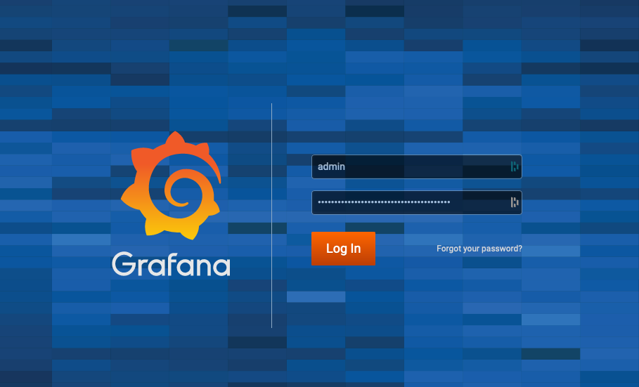
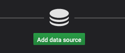
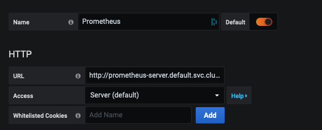
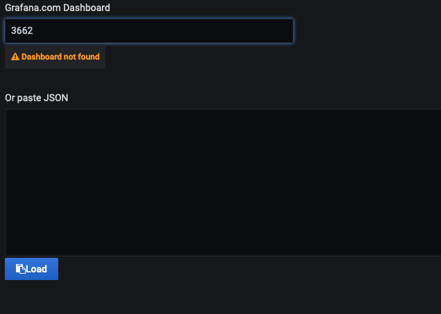
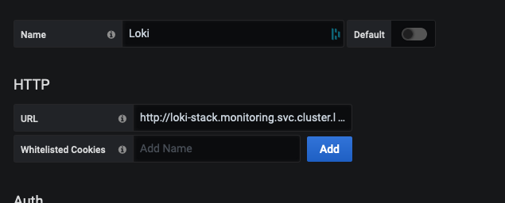

# Installing Helm3 and Monitoring

## Install HELM3

You can install Helm3 with the following commands

	$ curl -fsSL -o get_helm.sh https://raw.githubusercontent.com/helm/helm/master/scripts/get-helm-3
	$ chmod 700 get_helm.sh
	$ ./get_helm.sh

If there is any problem you can see the docs there: [Install Helm3](https://helm.sh/docs/intro/install/)

Then we add the stable repo:
`$ helm repo add stable https://kubernetes-charts.storage.googleapis.com/`

You can see all charts available with: `helm search repo stable`

And you can see which repos you have with: `helm repo ls`

## Install Grafana

We create a namespace for the monitoring

`kubectl create namespace monitoring`

We install grafana on the cluster

`helm install -n monitoring grafana stable/grafana`

The following command give you the password to access the UI

	kubectl get secret --namespace monitoring $(helm ls -n monitoring | grep grafana | cut 	-f1) -o \
	jsonpath="{.data.admin-password}" | base64 --decode ; echo

To access to the UI locally on the machine you can do some port forwarding on port 3000

	kubectl --namespace monitoring port-forward $(kubectl get pods -n monitoring | grep 	grafana | cut -d' ' -f1) \
	3000

Or you can create a service to access it remotely too

	kubectl expose -n monitoring deployment $(kubectl get --namespace monitoring deployments | grep grafana | cut -d' ' -f1) \
	--name=grafananodeport --port=3000 --target-port=3000 --type=NodePort
	
You can have the port with the following command

`kubectl get -n monitoring svc | grep grafananodeport | cut -d'/' -f1 | rev | cut -d':' -f1 | rev`

##Install Prometheus

The same way we installed Grafana we install Prometheus

First you create a file values.yaml and copy the content of the original [values.yaml](https://raw.githubusercontent.com/helm/charts/master/stable/prometheus/values.yaml) for prometheus into it.
Then you have to change the persistentVolume for alert-manager and server, pass the enable variable to false (Line 172 and line 741)

We can now launch prometheus and port-forward the server pod:

	helm install -n monitoring prometheus stable/prometheus -f promeValue.yaml

We can now show data that Prometheus get in Grafana.

##Install Loki

First we add the Loki repo and we deploy the loki stack (the version can change see the [Helm Hub page for loki-stack](https://hub.helm.sh/charts/loki/loki-stack)):

	helm repo add loki https://grafana.github.io/loki/charts
	helm install -n monitoring loki-stack loki/loki-stack --version 0.36.1
	
	
##Setup Dashboards in Grafana

We first login into grafana on the webpage

Click on data source:

Then on Prometheus:

In the URL field put:

`http://prometheus-server.monitoring.svc.cluster.local:80`

And click on save and test:

We now add a dashboard:

We can use this template for example:3662

We repeat the process for loki:

In the config of datasource we put the following in the url field:

`http://loki-stack.monitoring.svc.cluster.local:3100`

You should now have this in Datasources:

And we setup a dashboard for loki with this template for example:11489
	
